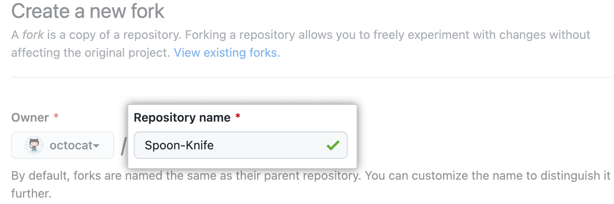
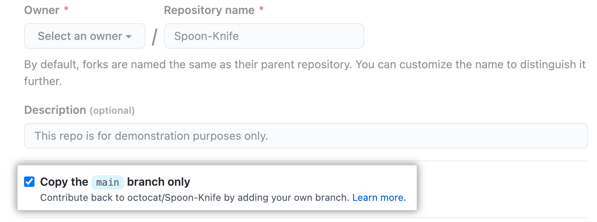
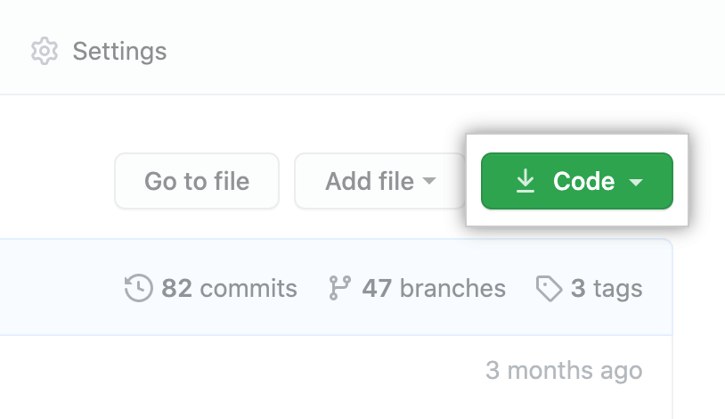
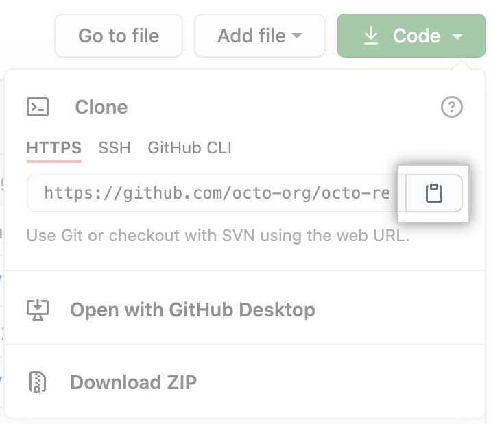

<p align="center">
  <a href="https://twitter.com/jpaulo_faveri"></a>
  <a href="https://www.linkedin.com/in/joaofaveri/"></a>
  <a href="mailto:joao.faveri@gmail.com"></a>
</p>
<!-- PROJECT LOGO -->
<br />
<div align="center">
  <a href="https://github.com/joaofaveri/pull-request-na-pratica">
    
  </a>

<h1 align="center">Pull Request na Prática</h1>
<h3><i>Saiba na prática como criar um Pull Request, submetendo alterações neste repositório</i></h3>
<h4>Apoie esta iniciativa! Marque com :star: o repositório!</h4>
</div>
<br />

De acordo com o Glossário da GitHub, Pull Requests (ou simplesmente PRs) são alterações propostas em um repositório enviadas por um usuário e que são aceitas ou rejeitadas pelos colaboradores do repositório. Muitos programadores, especialmente os iniciantes, por mais que desejem contribuir de alguma forma com projetos de código aberto, sentem-se pouco confiantes. Com este repositório, você terá oportunidade de conhecer melhor o que é o Pull Request e como realizá-lo. Mais do que isso, contribuirá com o repositório enviando seu Pull Request.


## Entenda como Fazer um Pull Request

As pull requests permitem que você envie as alterações das quais você fez push para um branch em um repositório no GitHub. Depois que uma pull request é aberta, você pode discutir e revisar as possíveis alterações com colaboradores e adicionar commits de acompanhamento antes que as alterações sofram merge no branch base.

### Fork ou Bifurcação

Em nosso caso, vamos utilizar o modelo de bifurcação ou ``fork``. A bifurcação é uma cópia de um repositório para a sua conta do GitHub, permitindo que faça alterações e experiências à vontade, sem comprometer o projeto original. Ou seja, ao criar uma fork, podemos propor mudanças no projeto de outra pessoa ou usar o projeto com ponto de partida para o nosso próprio projeto.

Para isso, faça o seguinte:

1. Acesse o projeto no GitHub que você pretende bifurcar
2. No topo direito da página do repositório, clique no botão **Fork**


3. Selecione um proprietário para o repositório bifurcado (seu username no GithHub) e defina um nome. Por padrão, as bifurcações possuem o mesmo nome de seu repositório pai, mas fique à vontade para definir o nome de sua preferência. Opcionalmente, insira uma descrição



4. Escolha se será copiado o ramo padrão (``main branch``) ou todos os ramos existentes. Em geral, para contribuir com projetos open source, basta copiar o ramo ``main``.



5. Para finalizar o processo, clique em **Create Fork**


### Como clonar seu repositório fork

Para poder editar localmente os arquivos do repositório que você acabou de bifurcar, é necessário clonar o mesmo em seu computador:

1. Acesso a página do repositório fork em seu GitHub e, acima da lista de arquivos, clique em **Code**



2. Copie a URL do repositório para clonar seus arquivos. Você pode usar ``HTTPS``, ``SSH`` ou o ``GitHub CLI``. Neste exemplo, vamos usar o endereço HTTPS



3. No seu computador, no diretório onde pretenda ter o seu repositório clonado, abra o Terminal (OS e Linux) ou o Git Bash (Windows) e digite o seguinte comando:

```bash
$ git clone https://github.com/SEU-GITHUB-USERNAME/pull-request-na-pratica.git
```

4. Pressione **Enter** e seu clone local estará criado.

### Sincronizar o Fork com o Repositório Original

Vamos configurar o Git para manter a bifurcação sincronizada com o repositório original (``upstream``). Utilizando o Terminal (OS e Linux) ou o Git Bash (Windows), navegue até a pasta local onde foi clonado o projeto. Digite o comando ``git remote -v`` e pressione **Enter** para ver o repositório remoto que está configurado para sua bifurcação:

```bash
$ git remote -v
> origin https://github.com/SEU-GITHUB-USERNAME/pull-request-na-pratica.git (fetch)
> origin https://github.com/SEU-GITHUB-USERNAME/pull-request-na-pratica.git (push)
```

Agora, vamos adicionar o endereço do repositório original como ``upstream`` de nosso projeto:

```bash
$ git remote add upstream https://github.com/joaofaveri/pull-request-na-pratica.git
```

Para verificar o novo repositório upstream que você especificou para sua bifurcação, digite novamente ``git remote -v``. Você deverá visualizar a URL da sua bifurcação como ``origin`` (origem) e a URL do repositório original como ``upstream``.

```bash
$ git remote -v
> origin https://github.com/SEU-GITHUB-USERNAME/pull-request-na-pratica.git (fetch)
> origin https://github.com/SEU-GITHUB-USERNAME/pull-request-na-pratica.git (push)
> upstream https://github.com/joaofaveri/pull-request-na-pratica.git (fetch)
> upstream https://github.com/joaofaveri/pull-request-na-pratica.git (push)
```

Para manter sua bifurcação atualizada com o repositório ``upstream``, ainda no Terminal (OS e Linux) ou no Git Bash (Windows), navegue até a pasta local onde foi clonado o projeto e execute o seguinte passo a passo:

1. Obtenha os branches e os respectivos commits do repositório upstream

```bash
$ git fetch upstream
```

2. Faça o checkout do branch padrão local da sua bifurcação

```bash
$ git checkout main
```

3. Faça merge das alterações do branch padrão upstream (nesse caso, ``upstream/main``) no seu branch padrão local. Isso coloca o branch padrão da bifurcação em sincronia com o repositório upstream, sem perder as alterações locais.

```bash
$ git merge upstream/main
```

### Criar um branch

Ao fazer um fork de um projeto para contribuir, devemos evitar fazer alterações no branch principal (main) e posteriormente submeter o Pull Request. O ideal é separar as contribuições em novos ramos e submetê-los à consideração dos mantenedores do projeto original. Há duas maneiras de se fazer isso:

```bash
$ git branch NOME-DO-NOVO-BRANCH
$ git checkout NOME-DO-NOVO-BRANCH 
```

Existe um jeito mais rápido de criar um novo branch e, ao mesmo tempo, já mudar para ele:

```bash
$ git checkout -b NOME-DO-NOVO-BRANCH
```

A partir desse ponto, realize todas as alterações que deseja no código, crie um ``commit`` com mensagem explicando-as e faça um ``push`` desse branch para o seu repositório do GitHub

```bash
$ git commit -m "mensagem imperativa explicando as alterações, com até 50 caracteres"
$ git push origin NOME-DO-NOVO-BRANCH
```

### Fazendo o Pull Request

Acesse a página do seu repositório bifurcado na página do GitHub. Caso identifique que seu branch está à frente do branch principal do projeto original, aparecerá um botão sugerindo a comparação entre os ramos e a criação de um Pull Request. Clique no botão e insira uma mensagem explicativa sobre as alterações realizadas. Caso contrário, acima da lista de arquivos de seu repositório, existe o botão **Pull Request**. Clique no botão e, na página de comparação, clique em **compare across forks** (comparar entre bifurcações), utilizando o menu suspenso para selecionar o repositório upstream no qual deseja fazer merge das alterações e a sua branch na qual fez as alterações.

Para criar um pull request que está pronto para revisão, clique em **Criar Pull Request**. Para criar um rascunho de pull request, use o menu suspenso e selecione **Criar rascunho de pull request** e, em seguida, clique em **Rascunho de Pull Request**.


## Por que contribuir?

Contribuir com projetos de código aberto é uma maneira de aprender, ensinar e ganhar experiência! Estudantes e programadores mais experientes contribuem para projetos de código aberto pelas mais variadas razões:

- Melhorar softwares dos quais são usuários, corrigindo bugs ou implementando uma nova funcionalidade
- Aprimorar as habilidades e conhecimentos adquiridos
- Ampliar a rede de contatos profissionais, conhecendo e interagindo com pessoas que possuem os mesmos interesses
- Conhecer novos mentores e ensinar pessoas que estão iniciando na área
- Criar repositórios de projetos ou contribuições que aumentam a reputação e se mostram valiosos para levar a carreira a um novo nível
- Praticar as soft-skills na relação com outras programadores, exercitando liderança, gerenciamento, resolução de conflitos, organização de equipes, dentre outras


## Como contribuir?

Antes de qualquer coisa, sempre que for contribuir para um projeto de código aberto, é essencial ler a documentação do repositório, geralmente disponibilizada na pasta principal. Os seguintes arquivos são os mais comuns:

- **LICENSE**: todo projeto de código aberto deve possuir uma licença open source. Conheça a [licença](LICENSE) de nosso repositório!
- **README**: é uma espécie de *manual* do repositório, que além das boas-vindas, explica o porquê do projeto, sua utilidade e como usar os recursos disponibilizados.
- **CONTRIBUTING**: enquanto o `README` ajuda os membros da comunidade a usarem o projeto, o documento `CONTRIBUTING` é um passo a passo sobre como contribuir com o projeto. Ele explica que tipos de contribuições são permitidas e como funciona o processo. Se o arquivo existir, é sinal de que o projeto está aberto à contribuição dos demais usuários. Não deixe de ler nosso [guia de contribuição](CONTRIBUTING.md)!

Trabalharemos com duas formas de contribuição:

- Abrindo uma [Issue](https://github.com/joaofaveri/pull-request-na-pratica/issues)
- Abrindo uma [Pull Request](https://github.com/joaofaveri/pull-request-na-pratica/pulls)

Mais do que uma oportunidade para aprender sobre Pull Request, você pode contribuir com esse repositório enviando exemplos de códigos ``HTML``, ``CSS`` ou ``Javascript``. Algumas iniciativas semelhantes solicitam apenas a inclusão de alguma informação, como nome ou cidade onde mora. Nossa ideia é estimular você a relatar e divulgar conhecimento nessas linguagens essenciais para a Internet. Portanto, bora codar!

## Agradecimento aos Colaboradores

Obrigado por ajudar o Pull Request na Prática a crescer! 💪

<a href="https://github.com/joaofaveri/pull-request-na-pratica/graphs/contributors">
  
</a>

## License

O conteúdo deste repositório é distribuído sob a licença Creative Commons Legal (Code CC0 1.0 Universal). Para maiores detalhes, leia o arquivo [LICENSE](LICENSE).


## Créditos

Nosso agradecimento aos autores das imagens utilizadas neste repositório:

- <a href="https://www.freepik.com/free-vector/pull-request-concept-illustration_13135273.htm">Pull request concept illustration</a>, vetor criado por <a href="https://www.freepik.com/author/stories">storyset</a> e disponibilizado em Freepik :copyright:
- <a href="https://www.flaticon.com/premium-icon/html-language_5815394">Html Language free icon</a>, criado por <a href="https://www.flaticon.com/authors/juicy-fish">juicy_fish</a> e disponibilizado em Flaticon :copyright:
- <a href="https://www.flaticon.com/premium-icon/css-code_5815160">Css Code free icon</a>, criado por <a href="https://www.flaticon.com/authors/juicy-fish">juicy_fish</a> e disponibilizado em Flaticon :copyright:. Esse ícone foi personalizado para ilustrar o template dos códigos Javascript 
