  
  
  

<!-- PROJECT LOGO -->
 

  

<h3 align="center">Full Stack Open 2022 Exercises</h3>
<h4><i>Department of Computer Science - University of Helsinki</i></h4>

  

    This repository contains completed exercises from Full Stack Open 2022 submitted through GitHub. This course is an introduction to modern web development with JavaScript. The main focus is on single page applications implemented with React and supporting them with RESTful and GraphQL web services implemented with Node.js. The course also has parts on TypeScript, React Native, and Continuous integration. Other topics include debugging applications, container technology, configuration, managing runtime environments, and databases.
  

<!-- ABOUT THE PROJECT -->
## About The Course

This course is an introduction to modern web development with `JavaScript`. The main focus is on single page applications implemented with `React` and supporting them with `RESTful` and `GraphQL` web services implemented with `Node.js`. The course also has parts on `TypeScript`, `React Native`, and Continuous integration. Other topics include debugging applications, container technology, configuration, managing runtime environments, and databases.

Full Stack studies consist of the core course and multiple extensions:

- Core course - Full Stack Web Development
    - Part 0 - Fundamentals of Web apps
    - Part 1 - Introduction to `React`
    - Part 2 - Communicating with server
    - Part 3 - Programming a server with `NodeJS` and `Express`
    - Part 4 - Testing `Express` servers, user administration
    - Part 5 - Testing `React` apps
- Full Stack Web Development, extension 1
    - Part 6 - State management with `Redux`
- Full Stack Web Development, extension 2
    - Part 7 - React router, custom hooks, styling app with `CSS` and `webpack`
- Part 8 - Full Stack Web Development: `GraphQL`
- Part 9 - Full Stack Web Development: `TypeScript`
- Part 10 - Full Stack Web Development: `React Native`
- Part 11 - Full Stack Web Development: Continuous Integration / Continuous Delivery
- Part 12 - Full Stack Web Development: Containers
- Part 13 - Full Stack Web Development: relational databases

<!-- LICENSE -->
## License

Distributed under the MIT License. See `LICENSE.txt` for more information.
